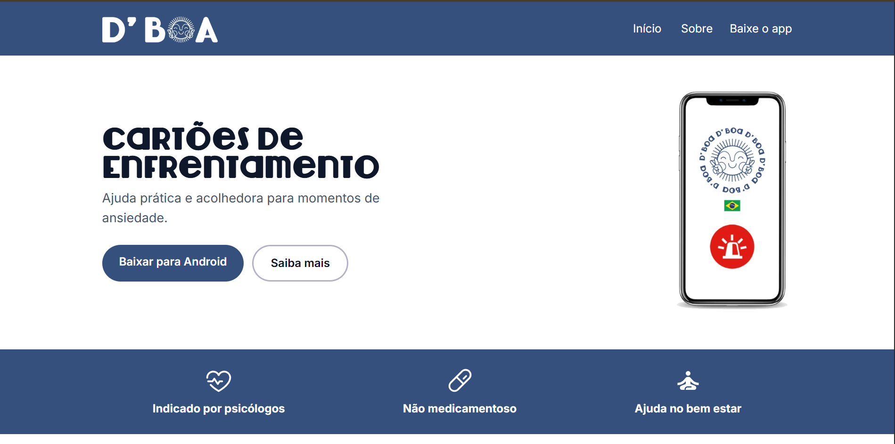
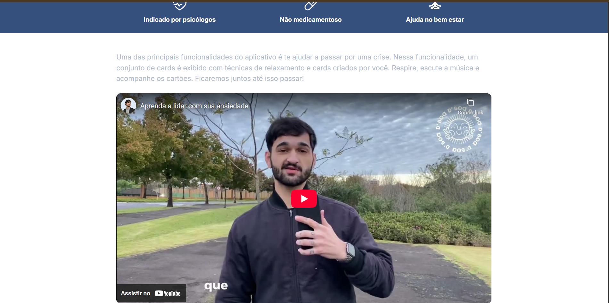
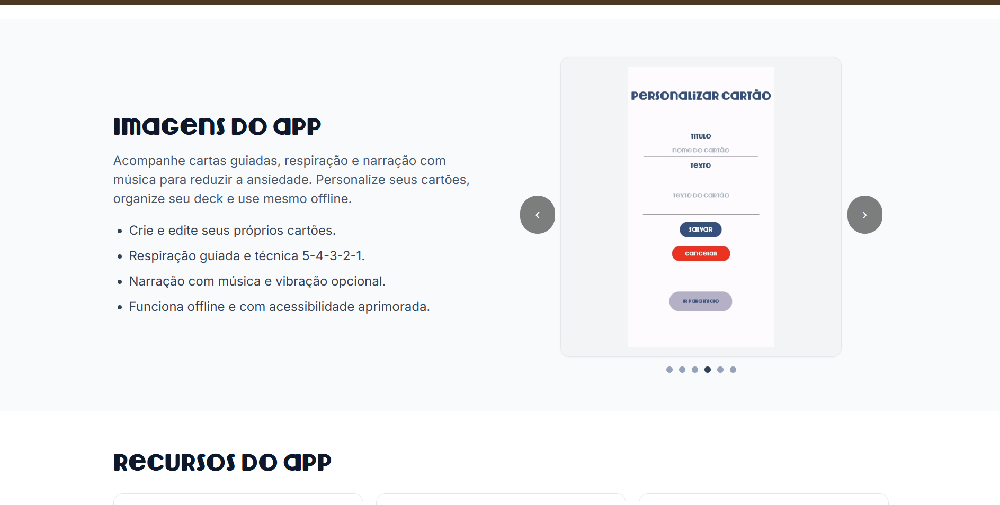
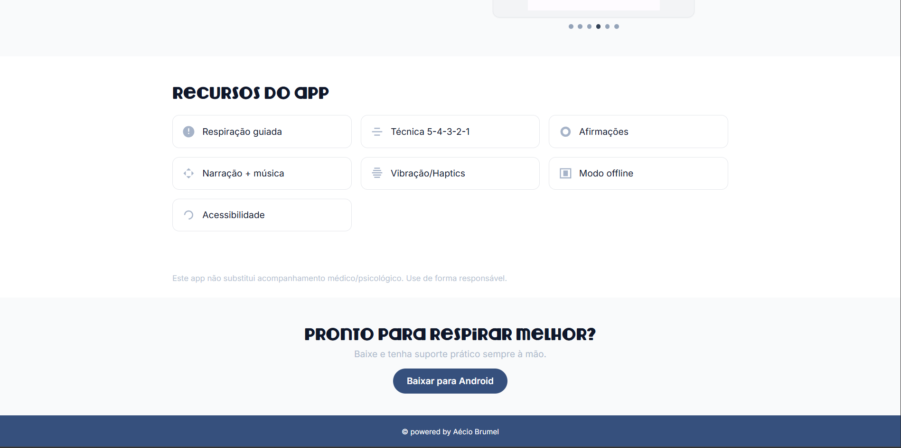

# dboa-landing-react

Landing page do projeto DBoa, feita com React e Vite.

## Sumário

- [Instalação](#instalação)
- [Prints](#prints)
- [Tecnologias utilizadas](#tecnologias-utilizadas)
- [Contribuição](#contribuição)
- [Licença](#licença)

## Instalação

Pré-requisitos: Node.js e npm.

1. Entre na pasta do app: `cd frontend`
2. Instale as dependências: `npm install`
3. Inicie o servidor de desenvolvimento: `npm run dev`

Scripts úteis:

- `npm run build`
- `npm run preview`
- `npm run lint`
- `npm run format`

## Prints

Adicione aqui as imagens do app/landing page em `docs/prints/`.

## Tecnologias utilizadas

- React
- React DOM
- Vite
- TypeScript
- Tailwind CSS
- PostCSS
- Autoprefixer
- ESLint
- Prettier

## Contribuição

1. Faça um fork do repositório.
2. Crie uma branch: `git checkout -b feat/minha-mudanca`
3. Faça commits claros e envie sua branch.
4. Abra um PR descrevendo o que mudou.

## Licença

MIT — veja `LICENSE`.
